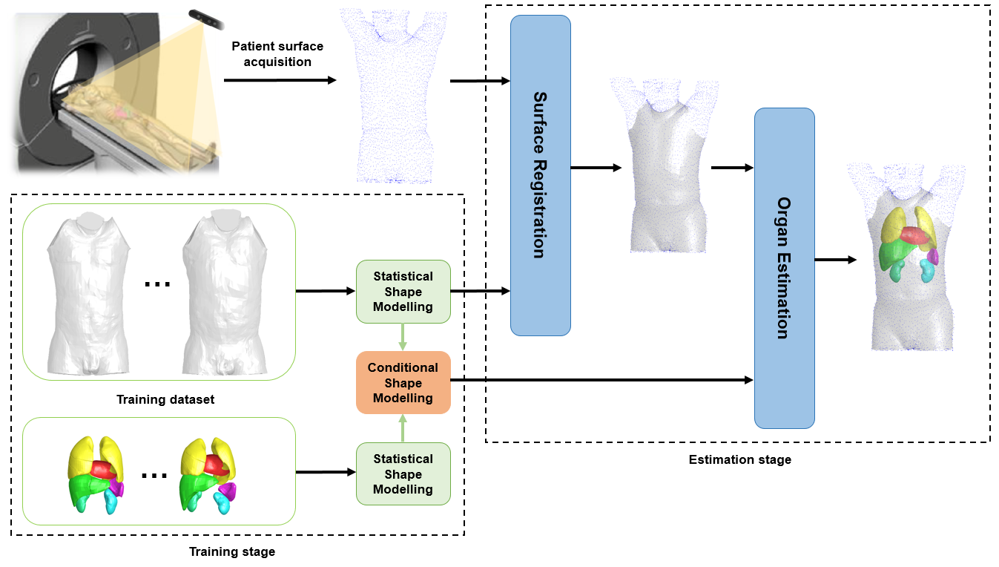
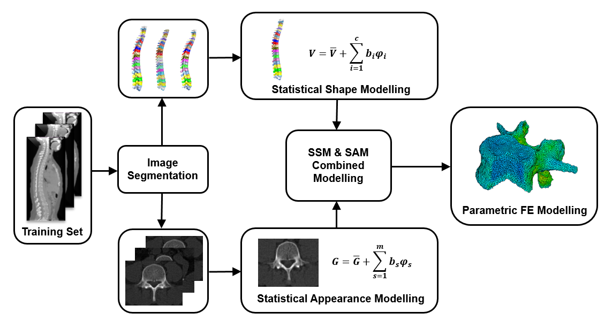
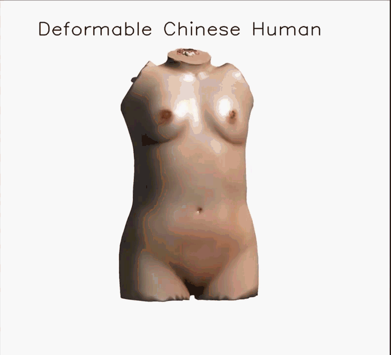

## About Me

I am currently a Ph.D. student at Faculty of Information Technology at [University of Jyväskylä](https://www.jyu.fi/it/fi), supervised by [Prof. Timo Hämäläinen](http://users.jyu.fi/~timoh/). Meanwhile, I also work closely with [Prof. Hongkai Wang](http://faculty.dlut.edu.cn/2014011045/en/index.htm). I obtained M.E. in Biomedical Engineering and B.E. in Mechanical Engineering from [Dalian University of Technology](https://en.dlut.edu.cn/) and [Sichuan University](https://en.scu.edu.cn/), respectively. 

**I am looking for the industrial position as data scientist or machine learning engineer.**

## Research Interests

Medical Image Analysis, Machine Learning, Computational Anatomy Modelling.

## Project Experience 

- **Research Collaborator with Siemens Shanghai Medical Equipment Company Ltd, Shanghai China**
   
  Participation in development of fully automatic diagnosis scanner system for Siemens Healthineers. My role included developing and validating data-driven pipeline for estimating major organ location from outer body surface.
   
  
  
- **Research Collaborator with INTESIM Company Ltd, Dalian China**
   
  Participation in biomechanical simulation for designing population-oriented ergonomic device. My role included developing a finite element spine model incorporating adjustable shape deformation and material distribution parameters learned from image dataset.
   
  
  
- **Research Collaborator with BOE Healthcare Company Ltd, Beijing China**
   
Participation in development of app [数字人体](https://apps.apple.com/cn/app/%E6%95%B0%E5%AD%97%E4%BA%BA%E4%BD%93/id1474729526) (translation in ”digital body”, available at Apple Store) for customized healthcare service platform. My role included developing a digital twin generation pipeline of whole-body anatomy given user’s metadata (height, weight and BMI) for 3D visualization in assisting interpretation of medical examination report.
   
  
  
- **Research Collaborator with Institute of Digital Medicine, Chongqing China**
   
Participation in development of statistical shape modeling of trunk anatomy for personalized digital twin generation.
   
  
  
## Publications

- **A Statistical Model of Spine Shape and Material for Population-Oriented Biomechanical Simulation**
   
  **Xiaobang Sun**, Hongkai Wang, Weiying Wang, et al.
   
  **IEEE ACCESS**.
   
  [[Link](https://ieeexplore.ieee.org/iel7/6287639/9312710/09618930.pdf)] 

- **Registration-based Construction of a Whole-body Human Phantom Library for Anthropometric Modeling**
   
  **Xiaobang Sun**, Hongkai Wang, Tapani Ristaniemi
   
  42nd Annual International Conference of the IEEE Engineering in Medicine & Biology Society. **EMBC 2020**.
   
  [[Link](https://ieeexplore.ieee.org/stamp/stamp.jsp?tp=&arnumber=9175295)]

- **Deformable torso phantoms of Chinese adults for personalized anatomy modelling**
   
  Hongkai Wang, **Xiaobang Sun**, Tongning Wu, et al.
   
  **Journal of anatomy**.
   
  [[Link](https://www.ncbi.nlm.nih.gov/pmc/articles/PMC5987821/)]

- **Dosimetric comparison using the human models reconstructed by precise segmentation, tissue simplification and template based registration**
   
  Congsheng Li, **Xiaobang Sun**, Tongning Wu
   
  12th European Conference on Antennas and Propagation. **EuCAP 2018**.
   
  [[Link](https://digital-library.theiet.org/content/conferences/10.1049/cp.2018.0494)]
